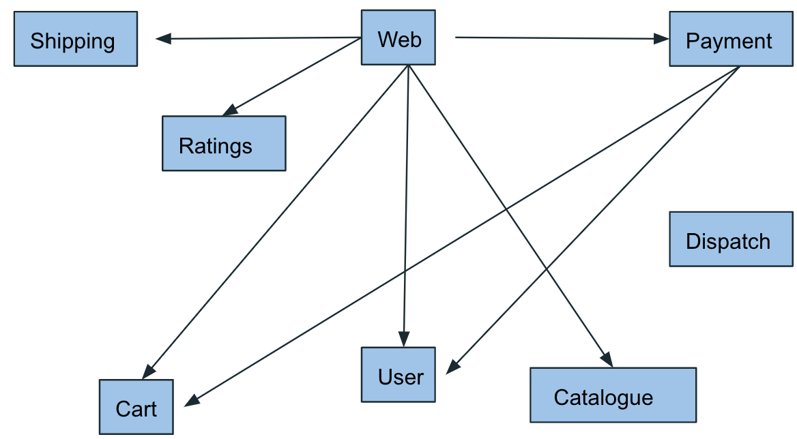

# Example Porter-Kustomize Implementations

## Deployment of a Complex CNAB Bundle

If we look at a complex, but real world relevant scenario, to deploy an application made up of
multiple (12) micro-services which simulates an end-to-end solution from Web UI, Shopping Cart, Catalogue,
Databases etc.



The `porter.yaml` is below. Yoiu will notice the different sections i.e. `install`, `upgrade` and `uninstall` all
look identical. This is because the `porter-kustomize` mixin is in fact executing exactly the same functionality.

As kustomize is simply responsible for generating the kubernetes manifests the actual different behaviour e.g.

``` yaml
kubectl apply -f
```

vs.

``` yaml
kubectl delete -f
```

is handled by the standard built-in mixin for kubernetes. The generation of the manifests by `porter-kustomize` for 
kuberntes to use is in fact identical. 

### `porter.yaml`

``` yaml
# This is the configuration for Porter
# You must define steps for each action, but the rest is optional
# See https://porter.sh/authoring-bundles for documentation on how to configure your bundle
# Uncomment out the sections below to take full advantage of what Porter can do!

name: Robotshop
version: 0.3.2
description: "Stans Robotshop Application"
invocationImage: porter-robotshop:latest
tag: dockerps/porter-robotshop-bundle:latest

# Uncomment out the line below to use a template Dockerfile for your invocation image
#dockerfile: Dockerfile.tmpl

mixins:
  - exec
  - kustomize
  - kubernetes

# See https://porter.sh/wiring/#credentials
credentials:
  - name: kubeconfig
    path: /root/.kube/config

parameters:
  - name: gh_token
    type: string
  - name: environment
    type: string
    default: local

install:
  - kustomize:
      description: "Installing: Use Kustomize to generate the Kubernetes deployment file for Stan's Robotshop"
      name: porter-robotshop-install
      kustomization_input: 
          - "kustomize/robotshop/overlays/{{ bundle.parameters.environment }}/cart"
          - "kustomize/robotshop/overlays/{{ bundle.parameters.environment }}/catalogue"
          - "kustomize/robotshop/overlays/{{ bundle.parameters.environment }}/dispatch"
          - "kustomize/robotshop/overlays/{{ bundle.parameters.environment }}/mongodb" 
          - "kustomize/robotshop/overlays/{{ bundle.parameters.environment }}/mysql"
          - "kustomize/robotshop/overlays/{{ bundle.parameters.environment }}/payment" 
          - "kustomize/robotshop/overlays/{{ bundle.parameters.environment }}/rabbitmq"
          - "kustomize/robotshop/overlays/{{ bundle.parameters.environment }}/ratings"   
          - "kustomize/robotshop/overlays/{{ bundle.parameters.environment }}/redis"     
          - "kustomize/robotshop/overlays/{{ bundle.parameters.environment }}/shipping"    
          - "kustomize/robotshop/overlays/{{ bundle.parameters.environment }}/user"   
          - "kustomize/robotshop/overlays/{{ bundle.parameters.environment }}/web"            
      kubernetes_manifest_output: manifests/
      set:
        kustomizeBaseGHToken: "{{ bundle.parameters.gh_token }}"

  - kubernetes:
      description: "Perform Robotshop Deployment"
      manifests:
        - manifests/
      wait: true

upgrade:
  - kustomize:
      description: "Upgrading: Use Kustomize to generate the Kubernetes deployment file for Stan's Robotshop"
      name: porter-robotshop-upgrade
      kustomization_input: 
          - "kustomize/robotshop/overlays/{{ bundle.parameters.environment }}/cart"
          - "kustomize/robotshop/overlays/{{ bundle.parameters.environment }}/catalogue"
          - "kustomize/robotshop/overlays/{{ bundle.parameters.environment }}/dispatch"
          - "kustomize/robotshop/overlays/{{ bundle.parameters.environment }}/mongodb" 
          - "kustomize/robotshop/overlays/{{ bundle.parameters.environment }}/mysql"
          - "kustomize/robotshop/overlays/{{ bundle.parameters.environment }}/payment" 
          - "kustomize/robotshop/overlays/{{ bundle.parameters.environment }}/rabbitmq"
          - "kustomize/robotshop/overlays/{{ bundle.parameters.environment }}/ratings"   
          - "kustomize/robotshop/overlays/{{ bundle.parameters.environment }}/redis"     
          - "kustomize/robotshop/overlays/{{ bundle.parameters.environment }}/shipping"    
          - "kustomize/robotshop/overlays/{{ bundle.parameters.environment }}/user"   
          - "kustomize/robotshop/overlays/{{ bundle.parameters.environment }}/web"            
      kubernetes_manifest_output: manifests/
      set:
        kustomizeBaseGHToken: "{{ bundle.parameters.gh_token }}"

  - kubernetes:
      description: "Perform Robotshop Upgrade"
      manifests:
        - manifests/
      wait: true

uninstall:
  - kustomize:
      description: "Unnstalling: Use Kustomize to generate the Kubernetes deployment file for removal"
      name: porter-robotshop-uninstall
      kustomization_input: 
          - "kustomize/robotshop/overlays/{{ bundle.parameters.environment }}/cart"
          - "kustomize/robotshop/overlays/{{ bundle.parameters.environment }}/catalogue"
          - "kustomize/robotshop/overlays/{{ bundle.parameters.environment }}/dispatch"
          - "kustomize/robotshop/overlays/{{ bundle.parameters.environment }}/mongodb" 
          - "kustomize/robotshop/overlays/{{ bundle.parameters.environment }}/mysql"
          - "kustomize/robotshop/overlays/{{ bundle.parameters.environment }}/payment" 
          - "kustomize/robotshop/overlays/{{ bundle.parameters.environment }}/rabbitmq"
          - "kustomize/robotshop/overlays/{{ bundle.parameters.environment }}/ratings"   
          - "kustomize/robotshop/overlays/{{ bundle.parameters.environment }}/redis"     
          - "kustomize/robotshop/overlays/{{ bundle.parameters.environment }}/shipping"    
          - "kustomize/robotshop/overlays/{{ bundle.parameters.environment }}/user"   
          - "kustomize/robotshop/overlays/{{ bundle.parameters.environment }}/web"            
      kubernetes_manifest_output: manifests/
      set:
        kustomizeBaseGHToken: "{{ bundle.parameters.gh_token }}"

  - kubernetes:
      description: "Perform Robotshop Undeployment"
      manifests:
        - manifests/
      wait: true


# See https://porter.sh/authoring-bundles/#dependencies
#dependencies:
#  mysql:
#    tag: deislabs/porter-mysql:latest
#    parameters:
#      database-name: wordpress
```

!!! note
    As kustomize allows for different parts of the kubernetes manifest yaml to be defined in different locations i.e.
    
    * local disk
    * remote git repository
    
    times to generate the kubernetes manifest can vary by a considerable amount i.e. with many micro-services all
    pulling base configuration from say GitHub this introduces quite an overhead timewise. 

#### CNAB Bundle Manifest

The beginning of the `porter.yaml` defines information for the generated CNAB bundle. 
This is lines 6-10 in the `porter.yaml` file.

#### `mixins:`

This is where we define the `mixins` to be used as part of the `install` and `uninstall` steps in porter. 
The *`mixin-runtime`* binaries will be copied into the docker `innvocationImage` in order porter can execute the
necessary steps.

This example defines usage of: -

* exec (not actually used)
* kustomize
* kubernetes

#### `credentials`:

The credentials definition on lines 21-23 is necessary in order that the `kubernetes` mixin can `apply` or `delete` the
specified manifests from the given cluster.

Creation of the credentials is done using the `porter credentials generate` command from the cli.

#### `parameters:`

For this advanced exmaple we have defined two parameters that we need to pass to `porter` as part of the innvocation.
These parameters are: -

* `gh_token`
* `environment`

##### `gh_token`

`gh_token` is used as our sample application uses a `kustomize` feature where base kubernetes manifest
configurations can be defined independantly from the application and leveraged by the application. These base
manifests can be referenced either locally on the filesystem using relative paths or remotely via `http/s` or point to
a `git` repository.

For this example the base manifests are referenced in a remote GitHub repository and in order for the
`porter-kustomize` mixin to access these repos a GitHub token is required to be used when performing a `pull` request
to download the code.

This can be seen to be defined on lines 26-27 of the `porter.yaml` and is used on lines 50-51.

##### `environment`

`environment`, the second parameter in our example is used to target which physical environment we are deploying to.
This is passed to the `porter-kustomize` mixin as the paths to the environment specific configuration contain the name
of the environment e.g. `"kustomize/robotshop/overlays/{{ bundle.parameters.environment }}/cart"`

The `environment` parameter is defined on lines 28-30 and if it is not passed as a commndline parameter to
porter at innvocation time will default to the `local` environment, i.e. the current host in our case, and is used on
lines 37-48 of the `install` step as well as the `upgrade` and `uninstall` steps lower down in the `porter.yaml`.


#### `install:` - `kustomize`

Looking at the specifics of what the `install` step does we can see the configuration for the `porter-kustomize` 
mixin starts at line 33. We define a `description` and `name` for the step which will be output to the console when 
running the `porter install` from our commandline (or in out CI/CD tool of choice `stdout`).

From this example we can see that using the `kustomization_input` attribute we can pass multiple different 
micro-services to the `porter-kustomize` mixin which is shown at lines 37 through 48. Each micro-service is in a
separate directory and each is processed sequentially by the mixin.

Line 49 is the `kubernetes_manifest_output` attribute which tells kustomize where to write out the generated kubernetes
manifest `yaml` files. 

!!! warning
    The `kubernetes_manifest_output` must match what is defined in the subsequent `install:` for `kubernetes` 
    configuration block `manifests` section and attributes which in our example are defined at lines 55-56.
    


#### `install:` - `kubernetes`

This is the configuration for the `kubernetes` mixin for porter. Here we define what we want `kubectl` to apply to 
the specified kubernetes cluster by pointing to a directory within the `innovcationImage` where it can find the 
necessary kubernetes `yaml` manifests.

This is not part of the `porter-kustomize` mixin but is present in order to be able to perform the 
deployments/upgrades/undeployments defined in the output from kustomize.

This plugin documentation can be found [here](https://porter.sh/mixins/kubernetes/) and the GitHub repository
is [here](https://github.com/deislabs/porter/tree/master/pkg/kubernetes).
